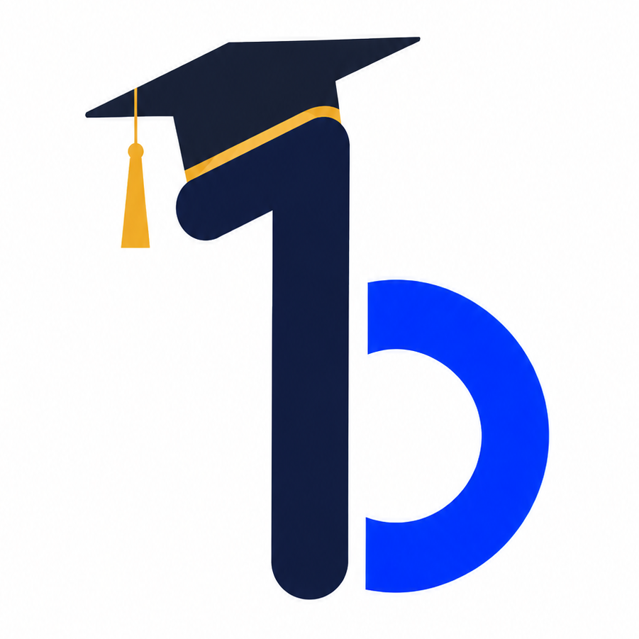
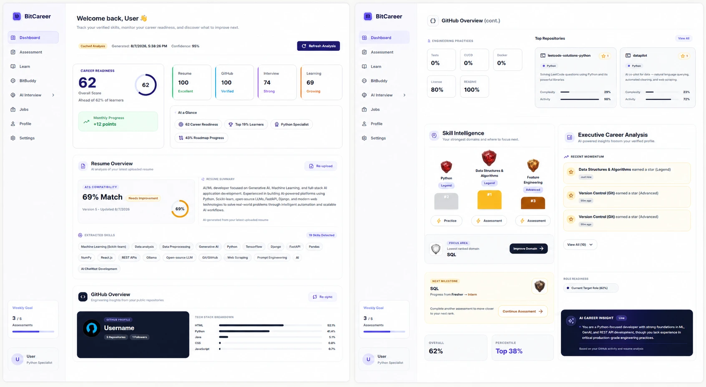
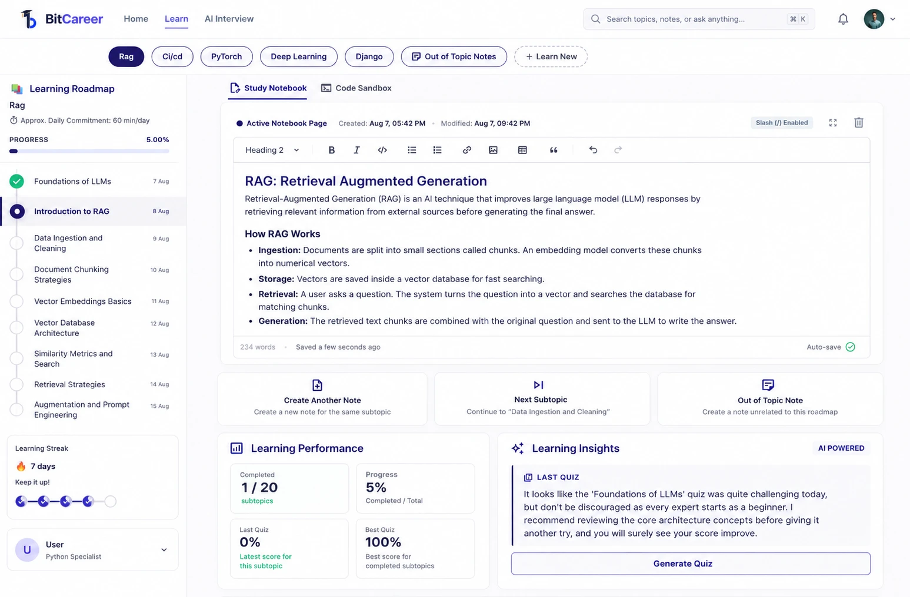

  

<h1 align="center">BitCareer</h1>

<strong>AI-Powered Learning & Career Readiness Platform for Developers</strong>

  
  
  
  
  
  
  
  
  

  <em>Portfolio showcase repository — source code is maintained privately. See <a href="#source-code">Source Code</a>.</em>

---

## Overview

**BitCareer** is an AI-powered platform that takes a developer from *"I want this job"* to *"I'm ready for this job"* — and proves it along the way.

Instead of handing users another static video course, BitCareer builds a personalised learning track around who they actually are. It reads their resume and GitHub profile during onboarding, works out where they currently stand, and generates a roadmap aimed at their target role. From there it becomes a full workspace: study notes and a live code sandbox side by side, an AI companion to unblock them, quizzes and hands-on coding assessments to validate what stuck, mock interviews to rehearse the real thing, and a ranked career dashboard that tracks readiness over time.

This repository showcases the project's features, design, and scope — without exposing the underlying source code.

## Features

### Onboarding & Profile
- **Guided multi-step onboarding** — personal information, education, technical skills, career goals, and a final review step before the profile goes live.
- **Resume upload & parsing** — upload a resume and have its content extracted into a structured skill profile.
- **GitHub profile analysis** — connect a GitHub account so real repositories and activity count as evidence of skill.
- **AI skill analysis** — BitCareer combines resume, GitHub, and self-reported skills into a baseline competency profile and starting rank, presented back to the user for review.

### Personalised Learning
- **AI curriculum planner** — generates a custom roadmap for the user's target role, shaped by their existing skills and how much time they can commit per day.
- **Structured roadmaps** — every track is broken into topics and subtopics with progress, difficulty, and estimated study time.
- **Learn something new, anytime** — start a fresh track on any topic from the master catalog, or let BitCareer suggest the next module.

### Learning Workspace
- **Dual-pane workspace** — a rich-text notes editor and an interactive code editor side by side, so studying and experimenting happen in one place.
- **Notion-style notes** — block-based editor with slash commands, formatting, code blocks, and attachments, organised per subtopic.
- **Notebook sidebar** — multiple notebooks per subtopic, pinning, and quick switching between them.
- **Interactive code sandbox** — write and run **Python** and **SQL** directly in the browser, with results, tables, and errors rendered inline.
- **Save your experiments** — send any sandbox run straight into your notes as a formatted code block, so working code never gets lost.
- **BitBuddy** — an AI learning companion available as a side drawer in the workspace and a floating assistant across the app, giving contextual explanations and debugging help with conversation history.

### Practice & Assessment
- **Auto-generated quizzes** — subtopic quizzes generated from what the user is actually studying.
- **Hands-on coding challenges** — real coding tasks executed and graded against hidden test cases, not just multiple choice.
- **Domain assessments** — broader assessments per career domain, with a domain picker, timed attempts, and a full review of every answer.
- **Active recall & remedial quizzes** — targeted follow-up sessions on the areas the user got wrong.
- **Knowledge retention tracking** — retention, mastery, and performance surfaced over time rather than as a single one-off score.
- **Assessment history** — every attempt is stored and reviewable, with rubrics and per-question breakdowns.

### AI Mock Interviews
- **Configurable sessions** — pick the target role and difficulty before starting.
- **Adaptive questioning** — the interviewer follows up based on how the previous answer went, focusing on demonstrated weak spots.
- **Voice-enabled** — push-to-talk answering with spoken interviewer questions, alongside typed responses.
- **Coding rounds** — a full code editor inside the interview for hands-on technical questions.
- **Live evaluation** — answers are scored as the session progresses, with notes captured along the way.
- **Detailed interview report** — per-competency scores, a session breakdown, and a score trend chart across past sessions.

### Career Dashboard
- **Career readiness score** — how close the user is to their target role, at a glance.
- **Ranked progression** — a gamified rank system spanning **Fresher → Intern → Skilled → Advanced → Elite → Master → Legend**, with stars earned per domain and promotion badges.
- **Skill radar** — visual mapping of current skill levels against the requirements of the target role.
- **Executive analysis** — an AI-written summary of where the user stands and what to fix next.
- **Personalised recommendations** — next-best actions surfaced directly on the dashboard.
- **Learning journey & career timeline** — a running history of completed topics, assessments, and milestones.
- **Resume & GitHub overviews** — the evidence behind the scores, kept visible.

### Platform
- **Account system** — sign up, log in, and a persistent session that survives refreshes.
- **Protected experience** — the dashboard, workspace, and interviews are gated behind authentication, with onboarding required before first use.
- **Dark, focused UI** — a consistent dark design system across the landing page, auth screens, dashboard, and workspace.

## Technology Stack

| Layer | Technology |
|---|---|
| Frontend | React 19, Vite, React Router |
| Editors | Monaco Editor (code), BlockNote (notes) |
| Styling | CSS Modules + custom design tokens |
| HTTP | Axios |
| Backend | Python, Django, Django REST Framework |
| Auth | JWT (SimpleJWT) |
| Database | PostgreSQL (SQLite in development) |
| AI | Google Gemini |
| Code Execution | Docker (isolated, ephemeral containers) |
| Document Processing | PDF parsing for resume ingestion |
| Integrations | GitHub API |

## Screenshots

> Screenshots are being added — drop the captures into `docs/screenshots/` to populate this section.

<!--
### Landing Page

  

---

### Onboarding

  

---

### Career Dashboard

  

---

### Learning Workspace

  

---

### Assessment

  

---

### AI Mock Interview

  

---

### Interview Report

  

-->

## Project Highlights

- Built a complete, end-to-end learning platform — onboarding, roadmap generation, study workspace, assessments, interviews, and analytics — rather than a single isolated feature.
- Turned real developer evidence (resume + GitHub) into a personalised starting point, so no two users get the same roadmap.
- Made learning *active*: users write and run real Python and SQL in the browser and save working experiments straight into their notes.
- Validated learning with hands-on coding challenges graded against hidden tests, not just quizzes.
- Designed a full career progression system — ranks, stars, domain scores, and readiness tracking — to make long-term progress visible and motivating.
- Delivered voice-enabled AI mock interviews with adaptive follow-up questions and a detailed post-session report.

## Source Code

The complete source code for BitCareer is maintained in a **private repository** and is not published here.

This repository exists as a **public showcase** — to let recruiters and other developers see what was built, what it offers, and the scope of the work, without exposing the underlying implementation.

If you'd like to discuss the implementation in more detail (e.g. for a technical interview), feel free to reach out.

## Project Status

BitCareer is a **working, feature-rich application** covering the full loop: onboarding and AI skill analysis, roadmap generation, the learning workspace with notes and sandbox, quizzes and assessments, AI mock interviews with reports, and the career readiness dashboard.

Areas still in progress:
- **Job matching** — job and company data models exist and the dashboard surface is built; live matching against real postings is not finished.
- **Project portfolio tracking** — groundwork laid, not yet surfaced in the product.

## What I Learned

Building BitCareer was a deep dive into:

- Designing a product with many interlocking surfaces — learning, practice, interviews, analytics — that still feels like one coherent experience.
- Building with AI as a product feature rather than a demo: making generated roadmaps, questions, and evaluations reliable enough to build a user's progress on.
- Running untrusted user code safely, and making a browser-based sandbox feel instant and stateful.
- Working with rich editors (block-based notes and a full code editor) inside a single-page app without the experience falling apart.
- Turning messy inputs — resumes, GitHub repos, quiz results, interview transcripts — into a single, meaningful measure of career readiness.
- Scoping and shipping a large project solo: deciding what had to be complete, what could stay minimal, and what could wait.
